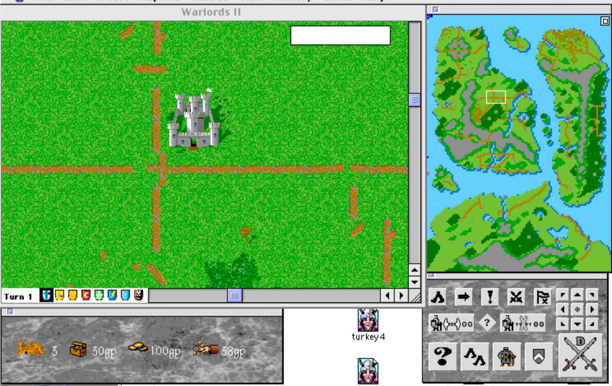

# Warlords II — PowerPC Reconstruction



A from-scratch reconstruction of **Warlords II** (1993, Strategic Studies Group) targeting Classic Mac OS / PowerPC. Built with [Retro68](https://github.com/autc04/Retro68) and tested in [SheepShaver](https://sheepshaver.cebix.net/).

## Prerequisites

1. **Retro68** — PowerPC cross-compiler toolchain for Classic Mac OS.
   Clone and build from [autc04/Retro68](https://github.com/autc04/Retro68). The build produces `powerpc-apple-macos-gcc`, `MakePEF`, and `Rez` in `build/toolchain/bin/`.

2. **Original Warlords II app** — You need a copy of the original Warlords II Mac application at `../Warlords II/Warlords II.app`. The resource fork (graphics, sounds, music, fonts) is copied from this during the build. The asset folders (`Terrain/`, `Armies/`, `Cities/`, `Shields/`) are also deployed from here.

3. **SheepShaver** — A Mac OS 9 VM for running the built application. The deploy script expects the VM's shared folder at `/Applications/MacOS9.sheepvm/unix/`.

## Building & Deploying

Edit the paths at the top of `src/deploy.sh` to match your Retro68 install and SheepShaver VM location:

```bash
export PATH="/path/to/Retro68/build/toolchain/bin:$PATH"
RINCLUDES="/path/to/Retro68/build/toolchain/multiversal/RIncludes"
DEST="/path/to/MacOS9.sheepvm/unix/Warlords II/Warlords II"
ORIG_RSRC="../Warlords II/Warlords II.app/..namedfork/rsrc"
```

Then build and deploy:

```bash
# Quick build — compiles only main.c, fastest iteration cycle
./src/deploy.sh solo

# Full build — runs make clean && make, then assembles
./src/deploy.sh
```

The deploy script does the following:

1. **Compile** — Cross-compiles with `powerpc-apple-macos-gcc` targeting Classic Mac OS PPC
2. **Convert to PEF** — `MakePEF` converts the XCOFF binary to the Preferred Executable Format that Mac OS expects
3. **Assemble the app** — Copies the PEF as the data fork, copies the original resource fork (graphics/sounds/music), and uses `Rez` to compile `warlords2.r` (code fragment and SIZE resources) into the resource fork
4. **Deploy** — `ditto` copies the assembled app and asset folders (preserving resource forks) into the SheepShaver shared folder

Launch SheepShaver and run "Warlords II" from the shared folder.

## Project Structure

- `src/main.c` — Main game source (single-file reconstruction)
- `src/include/` — Headers (`warlords2.h`, `wl2_types.h`, `wl2_globals.h`)
- `src/warlords2.r` — Rez source for cfrg and SIZE resources
- `src/deploy.sh` — Build, assemble, and deploy script
- `src/sound/` — Sound/music reference code (original decompiled QTMA routines)
- `docs/` — Research notes, resource catalogs, architecture docs
- `tools/` — Analysis and extraction scripts
