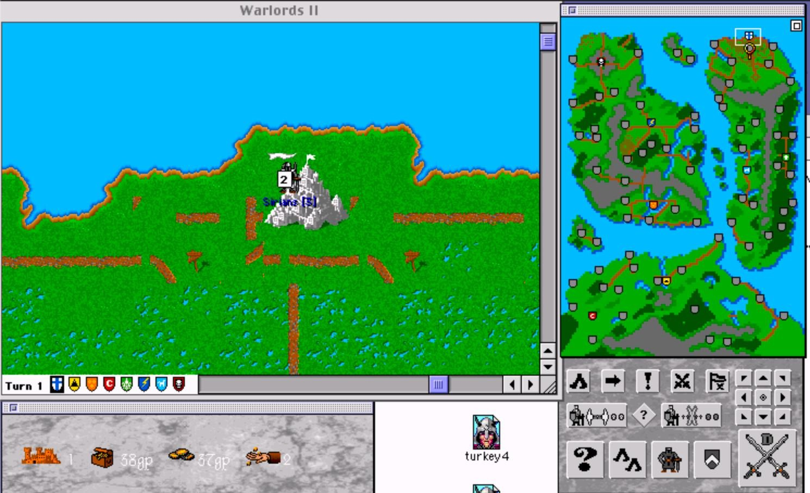
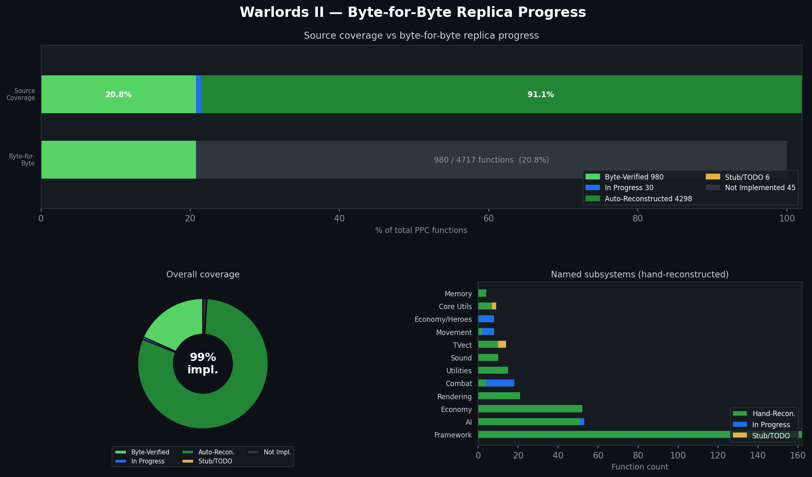

# Warlords II — PowerPC Reconstruction



## Byte-for-Byte Replica Progress



> Chart generated by `tools/gen_progress_chart.py` — increment `tools/byte_verified_count.txt` and rerun to update.

A from-scratch reconstruction of **Warlords II** (1993, Strategic Studies Group) targeting Classic Mac OS / PowerPC. Built with [Retro68](https://github.com/autc04/Retro68) and tested in [SheepShaver](https://sheepshaver.cebix.net/).

## Prerequisites

1. **Retro68** — PowerPC cross-compiler toolchain for Classic Mac OS.
   Clone and build from [autc04/Retro68](https://github.com/autc04/Retro68). The build produces `powerpc-apple-macos-gcc`, `MakePEF`, and `Rez` in `build/toolchain/bin/`.

2. **Original Warlords II app** — You need a copy of the original Warlords II Mac application at `../Warlords II/Warlords II.app`. The resource fork (graphics, sounds, music, fonts) is copied from this during the build. The asset folders (`Terrain/`, `Armies/`, `Cities/`, `Shields/`) are also deployed from here.

3. **SheepShaver** — A Mac OS 9 VM for running the built application. The deploy script expects the VM's shared folder at `/Applications/MacOS9.sheepvm/unix/`.

## Building & Deploying

Edit the paths at the top of `src/deploy.sh` to match your Retro68 install and SheepShaver VM location:

```bash
export PATH="/path/to/Retro68/build/toolchain/bin:$PATH"
RINCLUDES="/path/to/Retro68/build/toolchain/multiversal/RIncludes"
DEST="/path/to/MacOS9.sheepvm/unix/Warlords II/Warlords II"
ORIG_RSRC="../Warlords II/Warlords II.app/..namedfork/rsrc"
```

Then build and deploy:

```bash
# Quick build — compiles only main.c, fastest iteration cycle
./src/deploy.sh solo

# Full build — runs make clean && make, then assembles
./src/deploy.sh
```

The deploy script does the following:

1. **Compile** — Cross-compiles with `powerpc-apple-macos-gcc` targeting Classic Mac OS PPC
2. **Convert to PEF** — `MakePEF` converts the XCOFF binary to the Preferred Executable Format that Mac OS expects
3. **Assemble the app** — Copies the PEF as the data fork, copies the original resource fork (graphics/sounds/music), and uses `Rez` to compile `warlords2.r` (code fragment and SIZE resources) into the resource fork
4. **Deploy** — `ditto` copies the assembled app and asset folders (preserving resource forks) into the SheepShaver shared folder

Launch SheepShaver and run "Warlords II" from the shared folder.

**Primary testing campaign:** Erythea (no port cities, good coverage of ruins/temples and multi-faction combat).

## Original Compiler

Warlords II was compiled with **Metrowerks CodeWarrior** (approximately CW Gold 7–9,
circa 1995–1996). The retail binary is a **fat binary** containing both 68k and
PowerPC (CFM) code from the same C++ source.

Key compiler characteristics relevant to this reconstruction:

| Property | CodeWarrior 68k | MPW / GCC / Retro68 |
|---|---|---|
| Default `int` size | **2 bytes** | 4 bytes |
| Pointer return register | **A0** | D0 |
| Struct alignment | mac68k (2-byte default) | varies |
| Inter-segment calls | `JSR offset(A5)` (jump table) | same |

**PPC**: Code Fragment Manager (CFM) format, stored in the data fork. RTOC (R2) is
the global data pointer (equivalent to A5 for 68k). Standard PowerPC ABI with
R3–R10 for arguments, R3 for return value, 16-byte stack alignment.

**68k**: Resource fork CODE resources with a jump table at `CODE 0`. A5 world for
globals. A6 = frame pointer (LINK/UNLK). Return values: integers in D0, pointers
in A0 (CodeWarrior convention).

See [`docs/CODEWARRIOR.md`](docs/CODEWARRIOR.md) for a full technical reference
covering the 68k and PPC ABIs, struct alignment pragmas, inter-segment call
mechanics, Mixed Mode interop, and key differences from MPW/GCC.

## UI Design Decisions

Key dialog and UI design decisions are documented in [`docs/plans/`](docs/plans/). Summary:

### City Build Selection (`ShowCityBuildSelection`)

Full-window overlay matching the original Warlords II city production screen. See [`docs/plans/2026-02-26-city-build-selection-design.md`](docs/plans/2026-02-26-city-build-selection-design.md) for full spec. Key decisions:

- **Full-window replacement** (not a modal popup): a `CWindow` the same size as the main game window. Left half = live map at current viewport with a red box around the capital tile. Right half = marble panel.
- **Right panel layout**: faction name (Illuria 24pt gold) → "CAPITAL" shield + "Current:" ring indicator → row of up to 4 unit type icons each with a 36×36 procedurally-drawn selection ring (solid purple/blue when selected, grey outline when not) → STOP button → bottom action buttons + Done.
- **Selection rings**: drawn via `FrameOval`/`PaintOval`, unit sprite drawn centered on top. No separate ring resource needed.
- **Triggers**: fires automatically at turn start for any owned city with `extCity+0x02 < 0` (no production set), and on any city click.
- **Escape/Cancel**: leaves production unset; auto-prompt fires again next turn.
- **68k reference**: `CODE_045.c` `FUN_00000e5c` (city view render), `FUN_000011ca` (city view init).

## Project Structure

- `src/main.c` — Main game source (single-file reconstruction)
- `src/include/` — Headers (`warlords2.h`, `wl2_types.h`, `wl2_globals.h`)
- `src/warlords2.r` — Rez source for cfrg and SIZE resources
- `src/deploy.sh` — Build, assemble, and deploy script
- `src/sound/` — Sound/music reference code (original decompiled QTMA routines)
- `docs/` — Research notes, resource catalogs, architecture docs
- `docs/CODEWARRIOR.md` — Original compiler technical reference
- `docs/terrain_resources.md` — Terrain sprite sheets and PICT 30010 sprite map
- `tools/` — Analysis and extraction scripts

## Intentional Deviations from 68k Original

While this reconstruction aims for high fidelity to the original 68k Warlords II, a few behaviors have been intentionally omitted or changed for the modern emulator context:

- **No loading screen** — The original displayed a loading/splash screen while resources were read from disk. On modern machines running in SheepShaver, loading completes near-instantly, making the screen unnecessary.
- **No 256-color mode switch** — The original switched the display to 256 colors on launch. This is unnecessary in emulators and can cause display issues, so it has been disabled.

## License & Permission

This project has received permission from the original developers to pursue this faithful re-creation of Warlords II.
